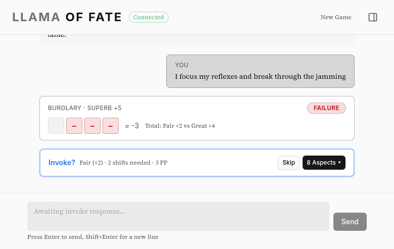
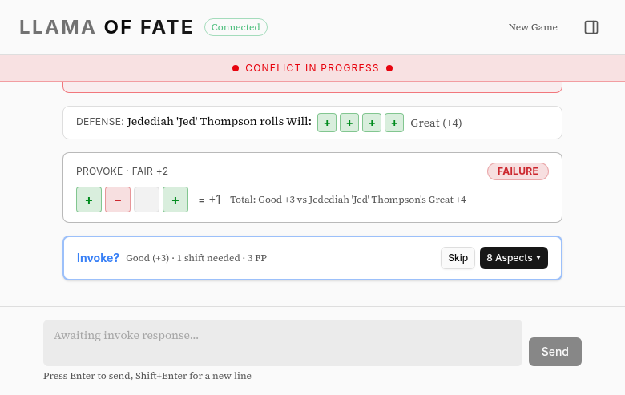

# LlamaOfFate

[](https://github.com/C-Ross/LlamaOfFate/actions/workflows/validate.yml)
[](LICENSE)

A text-based RPG system implementing the Fate Core rules with LLM-powered generation and action interpretation.



## Overview

LlamaOfFate is a text-based RPG that brings the flexibility and narrative focus of Fate Core to a digital medium. The system leverages Large Language Models (LLMs) to:

- Parse freeform text input into game actions
- Generate dynamic descriptions and narrative responses
- Assist with scene management and story progression
- Provide contextual suggestions for aspects and consequences



## Core Design Philosophy

- **Narrative First**: All game mechanics serve the story
- **Player Agency**: Natural language input allows for creative problem-solving
- **LLM Integration**: AI assists but doesn't replace human creativity and decision-making
- **Fate Core**: Faithful implementation of official Fate Core rules
- **Event-Driven UI**: Engine emits structured events; UI implementations control presentation

## Fate Core System

This system implements the [Fate Core System Reference Document](https://fate-srd.com/fate-core), which is available under the Creative Commons Attribution 3.0 Unported license.

**Credits:** This work is based on Fate Core System, a product of Evil Hat Productions, LLC, developed, authored, and edited by Leonard Balsera, Brian Engard, Jeremy Keller, Ryan Macklin, Mike Olson, Clark Valentine, Amanda Valentine, Fred Hicks, and Rob Donoghue, and licensed for our use under the [Creative Commons Attribution 3.0 Unported license](https://creativecommons.org/licenses/by/3.0/). This software is an original implementation of the Fate Core rules; it is not the Fate Core SRD text itself.

Fate™ is a trademark of Evil Hat Productions, LLC.

## Key Features

### Natural Language Processing
- **Action Parsing**: Convert free-form text like "I sneak past the guards using the shadows" into structured game actions
- **Context Awareness**: LLM maintains awareness of current scene, character capabilities, and recent events
- **Fluid descriptions** The LLM narrates the outcome in fluid prose, incorporating aspects and outcomes.

### Fate Core Mechanics
- **Aspect System**: Full support for character, situation, and consequence aspects
- **Complete Skill System**: All 18 default Fate Core skills with proper action mappings
- **Stress and Consequences**: Proper implementation of physical and mental damage
- **Fate Point Economy**: Track and manage fate point spending and gaining
- **Challenge System**: Multi-task challenges with skill-based overcome actions and outcome tallying

### Scene Management
- **Dynamic Scenes**: Create and modify scenes with situation aspects
- **Conflict System**: Handle conflicts with initiative, zones, and positioning
- **Challenge System**: Multi-step challenges with task tracking and partial success
- **Narrative Continuity**: Maintain story context across scenes and sessions

## Quick Start

### Prerequisites

- [Go 1.22+](https://go.dev/dl/)
- [Node.js 20+](https://nodejs.org/)
- [`just`](https://github.com/casey/just/releases)
- An LLM backend: [Ollama](https://ollama.ai/) (local) or a cloud provider (OpenAI-compatible/Azure)

### Clone and Build

```bash
git clone https://github.com/C-Ross/LlamaOfFate.git
cd LlamaOfFate
just go-deps
just web-install
just build
```

### Configure Your LLM Backend

LlamaOfFate supports multiple backends. Pick one of the options below.

#### Option A: Ollama (Local)

Install [Ollama](https://ollama.ai/), pull a model, then run:

```bash
export LLM_CONFIG=configs/ollama-llm.yaml
just run
```

The default `configs/ollama-llm.yaml` targets `http://localhost:11434` with model `llama3.2:3b`.

#### Option B: Cloud (OpenAI-compatible, including Azure)

LlamaOfFate uses any OpenAI-compatible endpoint. The default config file is `configs/azure-llm.yaml`.

```bash
export AZURE_API_ENDPOINT="https://your-resource.cognitiveservices.azure.com/openai/deployments/your-deployment/chat/completions?api-version=2024-05-01-preview"
export AZURE_API_KEY="your-api-key-here"
just run
```

Environment variables take precedence over file values, so config files can safely keep empty credentials:

```yaml
api_endpoint: ""
api_key: ""
model_name: "Llama-4-Maverick-17B-128E-Instruct-FP8"
timeout: 300
```

## Development Automation

LlamaOfFate uses **GitHub Agentic Workflows** ([gh-aw](https://github.com/github/gh-aw)) for automated development tasks. The repository includes several AI-powered workflows:

- **readme-updater**: Automatically updates README.md when significant changes are pushed to main
- **skills-updater**: Updates `.github/skills/` documentation when relevant code changes
- **coverage-improver**: Analyzes test coverage and suggests improvements

These workflows [run automatically](https://github.github.com/gh-aw/introduction/overview/).

**Installing gh-aw CLI:**
```bash
gh extension install github/gh-aw
```

## Building and Running

LlamaOfFate uses [`just`](https://github.com/casey/just) as a command runner for common development tasks.

For installation, see [casey/just](https://github.com/casey/just/releases).

### Just Commands

Run `just` without arguments to see all available commands. Common starting points:

- **`just validate`** - Run all validation checks (Go + Web)
- **`just build`** - Build the CLI application
- **`just run`** - Build and run the CLI
- **`just web-dev`** - Start Vite dev server

## Architecture

```
LlamaOfFate/
├── cmd/                        # Entry points (CLI, web server, MCP server)
├── internal/
│   ├── core/                   # Fate Core mechanics (character, dice, skills, conflicts)
│   ├── engine/                 # Game loop and scene/scenario management
│   ├── llm/                    # LLM integration (OpenAI-compatible)
│   ├── prompt/                 # LLM templates and response parsing
│   ├── ui/                     # UI implementations (terminal, web)
│   ├── session/                # Game transcript logging
│   ├── storage/                # Game state persistence
│   └── [other packages]
├── web/                        # React frontend (Vite, Tailwind, shadcn/ui)
├── examples/                   # Example programs (scene loops, scenario generation)
├── configs/                    # Configuration files
└── test/                       # Tests (unit, integration, LLM evaluation)
```

The engine is fully event-driven; UIs subscribe to GameEvents and drive gameplay via the GameSessionManager interface. See `docs/architecture.md` for details.

## Status

LlamaOfFate is playable and implements core Fate Core mechanics (aspects, skills, stress, consequences, challenges, conflicts), but not all advanced rules. It runs locally with multiple LLM backends (Ollama, OpenAI, Azure) and UIs (CLI, web, MCP). The web server is a development build and not ready for public deployment. The system remains under active development with rough polish.

## Contributing

Contributions are welcome! See [CONTRIBUTING.md](CONTRIBUTING.md) for dev setup, the `just validate` requirement, commit conventions, and the PR process.

Check out [open issues](https://github.com/C-Ross/LlamaOfFate/issues) for areas to contribute or to [report a bug or request a feature](https://github.com/C-Ross/LlamaOfFate/issues/new).

## License

The source code in this repository is licensed under the MIT License. See [LICENSE](LICENSE).

Fate Core SRD-derived rules content remains licensed under [CC BY 3.0 Unported](https://creativecommons.org/licenses/by/3.0/), including SRD-derived material in prompt templates and other rules-reference text.

## Acknowledgements

This project was developed with [GitHub Copilot](https://github.com/features/copilot).
