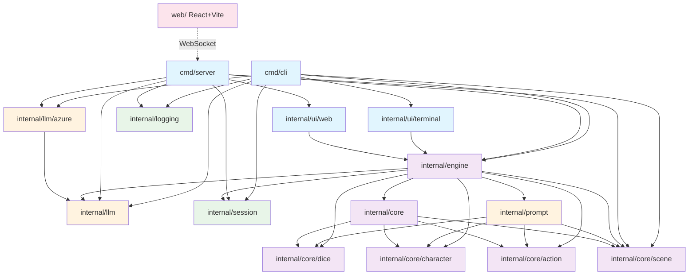

# LlamaOfFate Architecture

## Package Dependencies

```mermaid
graph TB
    %% Entry Points
    CLI[cmd/cli] --> Engine[internal/engine]
    CLI --> TerminalUI[internal/ui/terminal]
    CLI --> LLM[internal/llm]
    CLI --> Azure[internal/llm/azure]
    CLI --> Logging[internal/logging]
    CLI --> Session[internal/session]
    CLI --> Scene[internal/core/scene]

    Server[cmd/server] --> Engine
    Server --> WebUI[internal/ui/web]
    Server --> LLM
    Server --> Azure
    Server --> Logging
    Server --> Session
    Server --> Scene

    %% Web Frontend
    WebFrontend[web/ React+Vite] -.->|WebSocket| Server

    %% UI Dependencies
    TerminalUI --> Engine
    WebUI --> Engine

    %% Engine Dependencies
    Engine --> Prompt[internal/prompt]
    Engine --> LLM
    Engine --> Session
    Engine --> Core[internal/core]
    Engine --> Dice[internal/core/dice]
    Engine --> Character[internal/core/character]
    Engine --> Action[internal/core/action]
    Engine --> Scene

    %% Prompt Dependencies
    Prompt --> Scene
    Prompt --> Character
    Prompt --> Action
    Prompt --> Dice

    %% LLM Implementations
    Azure --> LLM

    %% Core Package Internal Dependencies
    Core --> Dice
    Core --> Character
    Core --> Action
    Core --> Scene

    %% Leaf Packages (no internal deps)

    %% Styling
    classDef entryPoint fill:#e1f5fe
    classDef core fill:#f3e5f5
    classDef infrastructure fill:#fff3e0
    classDef external fill:#e8f5e8

    classDef frontend fill:#fce4ec

    class CLI,TerminalUI,Server,WebUI entryPoint
    class Engine,Core,Dice,Character,Action,Scene core
    class Prompt infrastructure
    class LLM,Azure infrastructure
    class Session,Logging external
    class WebFrontend frontend
```
