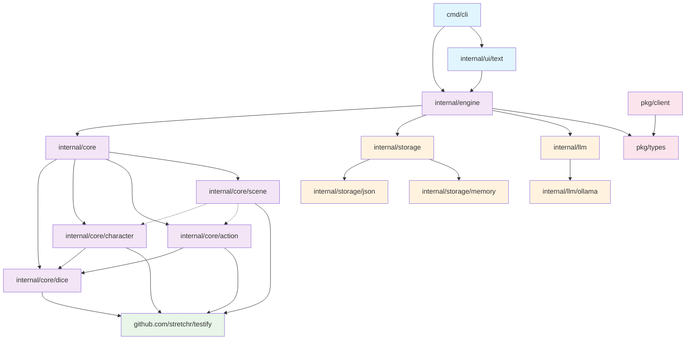

# LlamaOfFate Architecture

## Package Dependencies

```mermaid
graph TB
    %% Entry Points
    CLI[cmd/cli] --> Engine[internal/engine]
    CLI --> TextUI[internal/ui/text]
    
    %% Engine Dependencies
    Engine --> Core[internal/core]
    Engine --> Storage[internal/storage]
    Engine --> LLM[internal/llm]
    
    %% UI Dependencies
    TextUI --> Engine
    
    %% Core Package Internal Dependencies
    Core --> Dice[internal/core/dice]
    Core --> Character[internal/core/character]
    Core --> Action[internal/core/action]
    Core --> Scene[internal/core/scene]
    
    %% Internal Core Dependencies
    Character --> Dice
    Action --> Dice
    Scene -.-> Character
    Scene -.-> Action
    
    %% Storage Implementations
    Storage --> JSON[internal/storage/json]
    Storage --> Memory[internal/storage/memory]
    
    %% LLM Implementations
    LLM --> Ollama[internal/llm/ollama]
    
    %% Public API (Future)
    Engine --> PkgTypes[pkg/types]
    Client[pkg/client] --> PkgTypes
    
    %% External Dependencies
    Dice --> TestifyPkg[github.com/stretchr/testify]
    Character --> TestifyPkg
    Action --> TestifyPkg
    Scene --> TestifyPkg
    
    %% Styling
    classDef entryPoint fill:#e1f5fe
    classDef core fill:#f3e5f5
    classDef infrastructure fill:#fff3e0
    classDef external fill:#e8f5e8
    classDef future fill:#fce4ec
    
    class CLI,TextUI entryPoint
    class Engine,Core,Dice,Character,Action,Scene core
    class Storage,JSON,Memory,LLM,Ollama infrastructure
    class TestifyPkg external
    class Client,PkgTypes future
```
